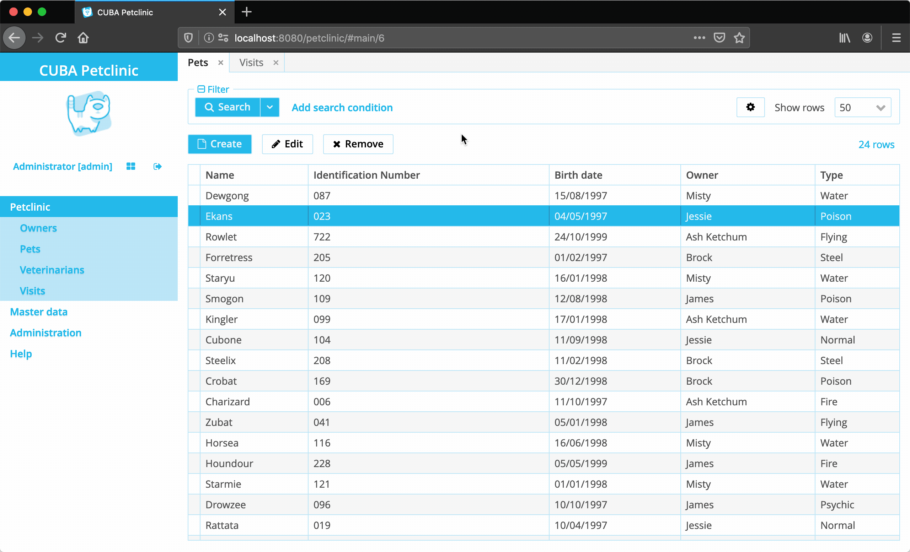

# CUBA Example Deactivated Entity Attributes

This CUBA example shows how to deactivate entity attributes once an entity was created.

NOTE: this example only works on the UI layer. In case this constraint has to be fulfilled throughout 
all parts of the application (like REST API, Entity Inspector etc.) a Bean Validation / EntityChangedEvent based approach 
has to be used.

### Running Example



### Variant 1: Manually

The first option is to manually activate a particular entity attribute in case the entity 
is new.

This can be achieved by making the field in the XML Screen descriptor non-editable:
```xml
<textField 
       property="identificationNumber" 
       id="identificationNumberField" 
       editable="false" />
``` 

In the screen controller the entity attribute will be activated in case it is a new entity instance:

```java

@UiController("petclinic_Pet.edit")
@UiDescriptor("pet-edit.xml")
@EditedEntityContainer("petDc")
@LoadDataBeforeShow
public class PetEdit extends StandardEditor<Pet> {

    @Inject
    protected TextField<String> identificationNumberField;

    @Subscribe
    protected void onInitEntity(InitEntityEvent<Pet> event) {
        identificationNumberField.setEditable(true);
    }
}
```

This variant works in case the amount of fields is not that big. In case there are multiple
entity attributes or the same logic has to be mirrored across different entities the Variant 2 is more suitable.


### Variant 2: Screen Mixin

The second option is based on the [Screen Mixin](https://doc.cuba-platform.com/manual-latest/screen_mixins.html) functionality
which allows to extract particular common login into an Interface.

In this case, the following Interface can be created in the web module `WithDeactivatableAttributes`:

```java

/**
 * Screen Mixin that allows to define a list of entity attributes, that should be
 * deactivated once an entity was created and is in edit mode
 */
public interface WithDeactivatableAttributes {


    /**
     * the list of Entity attributes that will be deactivated
     */
    List<Component.Editable> attributesToDeactivate();


    @Subscribe
    default void onInit(Screen.BeforeShowEvent event) {
        EntityStates entityStates = Extensions.getBeanLocator(event.getSource()).get(EntityStates.class);
        Entity editedEntity = ((StandardEditor) event.getSource()).getEditedEntity();

        if (!entityStates.isNew(editedEntity)) {
            attributesToDeactivate().forEach(
                    editable -> editable.setEditable(false)
            );
        }
    }

}
```

The interface has a method that needs to be implemented: `attributesToDeactivate` which should return the
corresponding list of Component instances that should be deactivated.

A usage of that interface can be found in the `VisitEdit` screen:

```java
public class VisitEdit extends StandardEditor<Visit> implements WithDeactivatableAttributes {

    @Inject
    protected LookupPickerField<Pet> petField;
    @Inject
    protected DateField<Date> visitDateField;

    @Override
    public List<Component.Editable> attributesToDeactivate() {
        return Arrays.asList(
            petField, visitDateField
        );
    }
}
```

